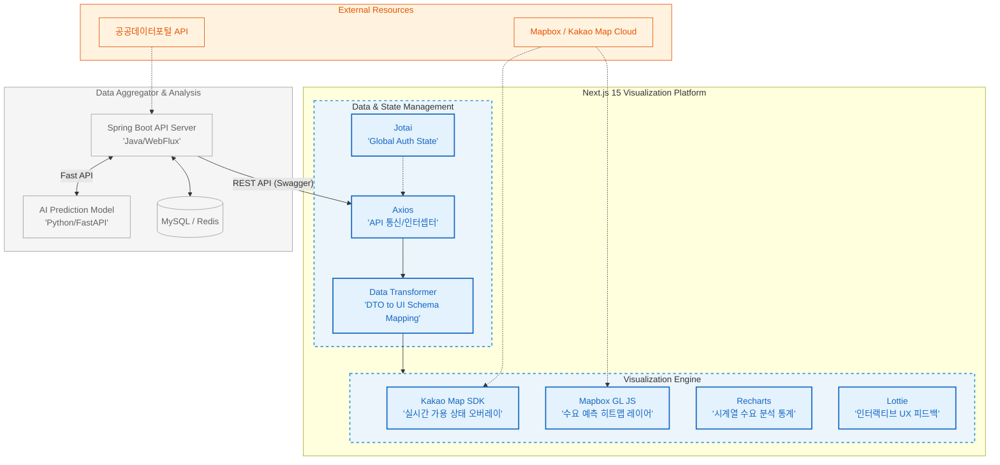

# Gridwiz: 전기차 충전 최적화 분석 웹서비스
> 사용자에게 충전소 혼잡도 예측을, 관리자에게는 지역별 수요 히트맵과 운영 지표를 제공하여 효율적인 충전 인프라 활용을 돕는 데이터 중심 플랫폼입니다.
<br>

## ✨ Key Features
### 1. 목적 기반 멀티 맵 엔진 및 시각화 정밀도 확보
- 사용자향(Kakao: 정밀 POI)과 관리자향(Mapbox: 고성능 히트맵) 엔진을 전략적으로 이원화하여 **타겟별 최적화된 UX** 제공.
- **Native SDK 리팩토링** 및 **Reconciliation(재조정) 제어** 전략을 통해 데이터 변경 시 마커의 시각적 무결성과 렌더링 성능 확보.

### 2. 타입 안전한 비동기 워크플로우 및 성능 최적화
- Swagger 명세 기반 TS 인터페이스 동기화와 `AbortController`를 활용하여 네트워크 경쟁 상태를 차단하고 통신 안정성 강화.
- `Promise.all` 병렬 패칭 및 Lottie 인터랙티브 피드백 도입으로 대규모 데이터 로딩 시의 사용자 이탈률 최소화.

### 3. 표준화된 데이터 파이프라인 및 운영 효율화(DX)
- Min-Max Scaling 알고리즘을 통한 시각적 무결성 및 UTC-KST 시계열 정규화를 통한 데이터 정합성 100% 확보.
- 비정형 데이터를 GeoJSON 표준 규격으로 실시간 변환하고, 관리자용 KPI 지표를 시각화하여 운영 데이터의 가독성 및 의사결정 효율 극대화.

### 4. 세션 거버넌스 및 보안 강화
- Sliding Expiration 전략 기반의 능동적 세션 관리로 보안 무결성을 확보하고, 사용자 활동에 반응하는 서비스 연속성 구현.
- `jwt-decode`를 활용한 인가 기반 라우팅 가드(Auth Guard) 및 실시간 만료 감지 시스템을 구축하여 클라이언트 사이드 보안 고도화.
<br>

## 🛠️ Tech Stack
### Frontend & Visualization
<p>
    
    
    
    
    
    
    
</p>

### Collaboration & Infrastructure
<p>
    
    
    
    
    
</p>

- **Next.js 15:** 최신 프레임워크 환경에서 고성능 대시보드 구축 및 클라이언트 사이드 렌더링(CSR) 최적화
- Multi-Map Integration: **Kakao Map**(국내 정밀 POI)과 **Mapbox**(고해상도 데이터 시각화)를 목적에 따라 전략적으로 통합 운영
- **TypeScript:** 엄격한 타입 정의를 통해 데이터 무결성을 확보하고 안정적인 유지보수 환경 구축
- **Recharts & Lottie:** 시계열 수요 예측 데이터의 시각화 및 인터랙티브 피드백 구현으로 데이터 가독성 및 몰입감 향상
- **Jotai:** 원자(Atom) 단위의 상태 관리를 통해 사용자 인증 세션 및 글로벌 토큰 정보를 효율적으로 제어
- **CSS Modules & Tailwind:** Tailwind의 빠른 유틸리티 스타일링 장점과 CSS Modules의 세밀한 UI 제어력(커스텀 스크롤바, 복잡한 애니메이션)을 결합
- **Swagger & Axios:** 백엔드(Spring/FastAPI)와의 API 명세 동기화 및 인터셉터를 활용한 타입 안정성(Type-safety) 확보
- **JWT Auth Flow:** `jwt-decode`를 이용한 클라이언트 사이드 권한 분기 및 보안 토큰 핸들링 로직 구축
<br>


## 🏗 System Architecture

<br>

## 💥 Critical Troubleshooting
### 1. 인증 세션 생명주기 관리 및 로그아웃 감지 결함 해결
- 문제: `layout.tsx`에 GNB를 배치한 구조에서 페이지 이동 시 레이아웃이 리렌더링되지 않아, 브라우저 토큰 만료가 UI에 즉각 반영되지 않는 보안 결함 발생.
- 해결: 헤들리스 컴포넌트 기반의 `TokenExpireWatcher`를 구축하여 `setInterval`로 세션 상태를 폴링(Polling)하고, 사용자 활동 감지 시 세션을 자동 연장하는 **Sliding Expiration 전략**을 도입하여 보안 무결성 확보.

<details>
<summary>자세한 해결 과정 보기 (Click)</summary>

#### **[Problem]**
- 전역 네비게이션바(GNB)를 `layout.tsx`에 배치한 구조에서, 브라우저에 저장된 JWT 토큰이 만료되었음에도 불구하고, UI 상에서는 로그아웃 처리가 즉각적으로 이루어지지 않아 보안 취약점 및 사용자 혼란 야기.

#### **[Analysis]**
- **레이아웃 영속성:** `layout.tsx`는 하위 페이지(`page.tsx`)가 변경되어도 상태를 유지하도록 설계되어 있어, 내부 로직에 의한 자동 상태 갱신이 어려움.
- **정적 만료 시간:** 로그인 시 부여된 만료 시간이 고정(Fixed)되어 있어, 활발히 활동 중인 사용자도 갑작스럽게 로그아웃되는 열악한 UX 제공.

#### **[Solution]**
- **TokenExpireWatcher 구축:** UI를 가지지 않는 Headless 컴포넌트를 설계하여 `layout.tsx`에 배치. setInterval을 활용해 1분 단위로 전역 상태(Jotai)에 저장된 만료 시간을 현재 시간과 대조하는 **Polling 메커니즘** 구현.
- **Sliding Expiration 전략 도입:** 브라우저의 전역 이벤트(`click`, `scroll`, `keydown` 등)를 감지하는 이벤트 리스너를 등록. 사용자의 활동이 감지될 경우 클라이언트 세션 만료 시간을 동적으로 연장하여 서비스 연속성 확보.
- **결과:** 세션 만료 시 즉각적인 라우팅 제어(Unauthorized Redirect)를 통해 보안 무결성을 확보하고, 사용자 활동 기반의 유연한 세션 관리 시스템 구축.
- [[🔎상세 코드 보러가기]](https://github.com/HaJi490/project2-2/blob/main/src/components/TokenExpireWatcher.tsx)
```tsx
useEffect(() => {
  // 1. 세션 만료 감시 (1분 주기 Polling)
  const checkToken = () => {
    if (expireAt && Date.now() > expireAt) {
      setToken(null); setExpireAt(null);
      router.push('/login?toast=세션이 만료되었습니다.');
    }
  };
  const timer = setInterval(checkToken, 60000);

  // 2. Sliding Expiration: 활동 감지 시 2시간 연장 (30초 쓰로틀링)
  const extendSession = throttle(() => {
    if (token && expireAt) setExpireAt(Date.now() + 7200000); 
  }, 30000);

  const events = ['mousedown', 'keydown', 'scroll'];
  events.forEach(e => window.addEventListener(e, extendSession));

  return () => {
    clearInterval(timer);
    events.forEach(e => window.removeEventListener(e, extendSession));
  };
}, [token, expireAt, setToken, setExpireAt, router]);
```

</details>

### 2. DOM 이벤트 전파 제어를 통한 복합 UI 레이어 간섭 해결
- 문제: 상세 패널 위에 '확인 모달'이 호출된 상태에서 버튼을 클릭할 때, 버튼의 기능이 실행되기 전 배경 패널의 닫기 로직이 선점되어 전체 UI가 비정상적으로 소멸되는 인터랙션 충돌 발생.
- 원인: 마우스 클릭이 완료되기도 전에 모달을 닫는 로직이 가장 먼저 실행되는 브라우저 이벤트 우선순위(Capture) 문제 확인. 이로 인해 확인 버튼이 화면에서 사라지면서 로직이 실행되지 않는 현상 발생.
- 해결: `stopPropagation()`을 통한 **이벤트 전파 차단**과 더불어, 상위 레이어의 노출 상태를 하위 핸들러가 검사하는 **상태 기반 가드(State Guard)** 로직을 구축하여 인터랙션 우선순위 확립.

<details>
<summary>자세한 해결 과정 보기 (Click)</summary>

#### **[Problem]**
- 지도가 포함된 복잡한 오버레이(Map > Panel > Modal) 환경에서, 최상위 레이어(모달)의 액션이 실행되기 전에 하위 레이어(패널)의 '외부 클릭 감지' 로직이 먼저 트리거되어 사용자 맥락이 끊기는 결함 확인.

#### **[Analysis]**
- **이벤트 전파 단계의 차이:** `ConfirmModal`은 외부 클릭을 즉각 감지하기 위해 `mousedown` 이벤트를 **캡처링(Capturing) 단계**에서 수신하도록 설계됨. 이는 버튼의 `click` 이벤트가 도달하기 전 최우선으로 실행되어 레이어의 파괴를 야기함.
- **이벤트 라이프사이클 충돌:** 사용자가 버튼을 누르는 찰나의 순간에 '외부 영역 클릭'으로 오인되어 컴포넌트가 **언마운트(Unmount)** 되면서, 정작 실행되어야 할 버튼의 핸들러가 소멸되는 메커니즘 확인.

#### **[Solution]**
- **명시적 전파 차단:** 모달 컨테이너에 `e.stopPropagation()`을 적용하여 내부 클릭 발생 시 부모 요소로의 이벤트 버블링을 명시적으로 차단.
- **상태 기반 제어 흐름(State Guarding):** 하위 레이어(Panel)의 이벤트 리스너 내부에 `if (modalInfo.show) return;` 조건을 추가. 상위 레이어가 활성화된 동안에는 하위 리스너의 실행을 조건부로 무시(Ignore) 하도록 설계하여 논리적 우선순위 확보.
- **결과:** 레이어 간 독립적인 생명주기를 보장함으로써 복잡한 오버레이(Map > Panel > Modal) 환경 내에서도 정밀하고 안정적인 UI 인터랙션 구현 성공.
- [[상세 코드 보러가기]](https://github.com/HaJi490/project2-2/blob/main/src/components/Home/StationDetailPanal/StationDetailPanal.tsx)
```tsx
// 1. 상세 패널: 상위 레이어(모달) 상태에 따른 이벤트 무시 전략
useEffect(() => {
  const handleClickOutside = (e: MouseEvent) => {
    // [방어 1] 모달이 떠 있을 때는 패널 닫기 로직을 완전히 차단
    if (modalInfo.show) return;

    // [방어 2] 지도/마커 클릭과 외부 영역 클릭을 구분 (Event Target 검사)
    const target = e.target as Element;
    if (target.closest('.kakao-map') || target.closest('.map-container')) return;

    if (panelRef.current && !panelRef.current.contains(target)) {
      onClose(); // 실제 외부 영역일 때만 닫기 실행
    }
  };
  document.addEventListener('click', handleClickOutside);
  return () => document.removeEventListener('click', handleClickOutside);
}, [modalInfo.show, onClose]);

// 2. 확인 모달: 이벤트 전파 차단으로 하위 레이어 간섭 방지
return (
  <div className="fixed inset-0" onClick={onCancel}>
    <div 
      ref={modalRef}
      onClick={(e) => e.stopPropagation()} // [방어 3] 클릭 이벤트가 패널로 전파되는 것 차단
    >
      <button onClick={onConfirm}>확인</button>
    </div>
  </div>
);
```
</details>


### 3. 목적별 멀티 맵 엔진 아키텍처 및 SDK 제어권 확보
- 문제: 초기 웹 호출 방식은 지리 정보의 정밀 제어와 히트맵 같은 고해상도 시각화 데이터를 표현하는 데 한계 존재.
- 해결: 사용자 페이지는 지리 정보가 정확한 **Kakao Map SDK**로 리팩토링하여 제어권을 확보하고, 관리자 페이지는 대량의 데이터 렌더링에 특화된 **Mapbox GL JS**를 전략적으로 도입. 엔진별 Native API를 직접 핸들링하여 서비스 목적에 최적화된 시각화 환경 구축.

<details>
<summary>자세한 해결 과정 보기 (Click)</summary>

#### **[Problem]**
- 프로젝트 초기 웹 링크 호출 기반의 지도 구현은 간단한 마커 표시에는 유리했으나, 일반 사용자를 위한 **'충전기 가용 대수 오버레이'** 구현과 관리자를 위한 **'수요 예측 히트맵'** 레이어 제어에 구조적 한계 봉착.

#### **[Analysis]**
- **추상화의 한계:** 상위 수준의 래퍼 라이브러리는 빠른 구현에는 유리하나, 지도 내부 렌더링 사이클에 직접 접근하는 자유도가 낮아 복잡한 커스텀 요구사항(실시간 가용 대수 마커 등) 대응에 제약이 큼.
- **사용자 타겟별 니즈 차이:** 일반 사용자는 '정확한 지형지물과 POI 정보(카카오)'가 중요하고, 관리자는 '데이터의 시각적 밀도와 분석 인사이트(맵박스)'가 핵심인 비즈니스적 요구사항 확인.

#### **[Solution]**
- **Native SDK 기반 리팩토링:** 기존 라이브러리 의존성을 제거하고 **Kakao Map Native SDK**를 직접 핸들링하도록 전면 개편. 명령형 API를 React의 선언적 환경에 맞게 직접 래핑하여 마커 렌더링 성능과 커스텀 오버레이 제어권 확보.
- **전략적 엔진 확장:** 대규모 데이터 시각화가 필요한 관리자 페이지에는 고해상도 벡터 렌더링에 특화된 **Mapbox GL JS**를 추가 도입. 이기종 맵 엔진 아키텍처를 구축하여 서비스 페르소나별 최적화된 시각화 경험 제공.
- 결과: 사용자에게는 정밀한 위치 기반 정보를, 관리자에게는 고성능 수요 히트맵을 제공함으로써 데이터 중심 플랫폼으로서의 엔지니어링 완성도 확보.

</details>
<br>

## 🔎 Engineering Deep Dive
### 1. 데이터 엔지니어링 및 정규화 (Data Transformer)
- **DTO-to-UI Normalization:** 
  - `useMemo`와 `lodash`를 활용해 서버 응답(DTO)을 클라이언트 전용 스키마로 변환하여 렌더링 부하 절감.
  - 상태 코드(Number)를 사용자 언어로 매핑.
  - Min-Max Scaling을 적용하여 수요 예측 데이터를 0~1 범위로 정규화해 데이터 편차에 따른 시각적 왜곡 방지 및 밀도 최적화.
- **비즈니스 데이터 집계(Aggregation):**  파편화된 백엔드 상태 코드들을 운영자 관점의 유의미한 지표로 재구성하는 데이터 매핑 레이어 구축
(_예: 여러 이상 상태를 '상태 이상' 카테고리로 그룹화하여 관리자 의사결정 효율 향상_)
- **GeoJSON 표준 규격화:** 비정형 위경도 데이터를 GeoJSON 형식으로 실시간 변환하는 파이프라인을 구축하여 Mapbox 엔진과의 호환성을 확보 및 좌표 데이터의 렌더링 성능 최적화.
- **ISO 8601 시계열 정규화:** `toISOString()` 메커니즘을 활용해 서버(UTC)와 클라이언트(KST) 간의 9시간 시차 문제를 보정하는 전처리 로직을 통해 예측 데이터의 시간적 신뢰도 확보.

### 2. 네트워크 및 인프라 (Network & Infrastructure)
- **Swagger 기반 타입 안전성 확보:** API 명세를 기반으로 TypeScript 인터페이스를 동기화하고, `Axios` 제네릭을 활용하여 런타임 에러를 방지하는 안정적인 풀스택 협업 환경 및 통신 아키텍처 구축.
- **병렬 데이터 패칭(Parallel Fetching):** `Promise.all` 전략을 도입하여 초기 렌더링 및 모드 전환 시 필요한 다중 API(현재 정보, 추천 데이터, 최단 거리 등)를 동시 수신함으로써 네트워크 병목 해결 및 로딩 속도 최적화.
- **비동기 요청 오케스트레이션:** `AbortController`와 `useRef`를 조합하여 네트워크 요청의 **경쟁 상태(Race Condition)**를 제어하고, 렌더링과 무관한 네트워크 컨트롤러 상태를 동기적으로 관리하여 불필요한 리소스 낭비 차단.
- **Auth Guard:** `jwt-decode`를 활용한 클라이언트 사이드 권한 분기 및 `layout.tsx` 내 세션 와처(Watcher)를 통한 보안 고도화.

### 3. 상태 관리 및 인터랙션 (State & Interaction)
- **단방향 데이터 흐름(SSOT) 구축:** 사용자 위치 정보(`myPos`)를 최상위 상태로 관리하여 지도 중심점, 검색 반경, 데이터 패칭이 유기적으로 연동되는 SSOT(단일 진실 공급원) 기반의 아키텍처 구현.
- **Atomic State 관리:** `Jotai`를 통해 전역 인증 및 세션 상태를 원자 단위로 관리.
- **Ref 기반 제어:**  `useRef` 플래그와 200ms Debounce 타이머를 활용하여 지도 마커 클릭과 외부 클릭 감지 로직 간의 타이밍 이슈(Race Condition)를 정밀하게 해결.
- **브라우저 이벤트 전파 제어:** 복합 오버레이 환경 내에서 발생하는 이벤트 전파(Bubbling/Capture) 및 발생 순서를 제어하여 모달과 상세 패널 간의 인터랙션 충돌을 방지하고 UI 무결성 확보.
- **Reconciliation(재조정) 제어:** 고유 식별자(Key/ID) 조작 전략을 통해 컴포넌트의 명시적 리마운트를 유도하여, 실시간 데이터 변경 시 마커 상태 불일치 해결 및 렌더링 무결성 확보.

### 4. 사용자/관리자 경험 최적화 (UX & Admin Experience)
- **Deep-dive 인터랙티브 툴팁:** 관리자 편의(AX)를 위해 요약 지표와 상세 데이터를 계층적으로 분리. Hover 툴팁 시스템을 통해 방대한 데이터의 가독성과 정보의 깊이를 동시에 제공하는 고밀도 대시보드 구현.
- **비동기 피드백 시스템:** AI 분석 및 대량 데이터 로딩 대기 시간 동안 Lottie 인터랙티브 애니메이션을 제공하여 사용자에게 심리적 대기 시간을 줄이고 이탈률을 최소화.
- **인증 기반 세션 거버넌스:** `Sliding Expiration` 전략을 도입하여 사용자 활동 감지 시 세션을 동적으로 연장하고, 토큰 만료를 실시간 감지하여 자동 로그아웃을 처리하는 견고한 보안 세션 관리 체계 수립.
<br>

## ⚙️ Getting Started
1. **Clone the repo & Install dependencies** 
    ```Bash
    git clone https://github.com/g1robot00/g1srobot-robotics-website.git

    cd g1srobot-robotics-website

    npm install
    ```

2. **Environment Variables**
_.env.local_ 파일을 생성하고 아래 키를 입력하세요.
    ```python

    ```

3. **Run development server**
    ```Bash
    npm run dev
    ```